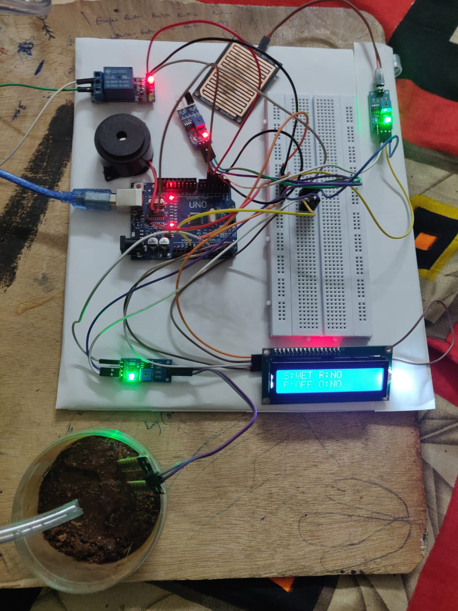

# Smart Irrigation & Intrusion Detection System

## Project Overview

An Arduino-based embedded system designed to automate irrigation based on soil moisture and rainfall conditions while detecting possible animal intrusion.

The system monitors soil moisture, rainfall, and obstacles using sensors. Based on the sensor readings, it automatically controls a water pump through a relay and activates a buzzer when an obstacle is detected. A 16x2 I2C LCD provides real-time information about soil, rain, pump, and obstacle status.

## Components Used

- Arduino Uno
- Soil Moisture Sensor
- Rain Sensor
- IR/Obstacle Sensor
- Relay Module
- Water Pump
- Buzzer
- 16x2 I2C LCD

## Technologies Used

- Arduino
- Embedded C
- Sensor Interfacing
- Automation
- Digital and Analog Input/Output

## Key Features

- Automatic irrigation based on soil moisture level
- Rainfall detection
- Automatic water pump control
- Animal intrusion detection
- Buzzer alert for detected obstacles
- Real-time status display using a 16x2 I2C LCD

## Working

### 1. Soil Moisture Monitoring

The soil moisture sensor measures the moisture level of the soil.

- If the soil value is greater than 700, the soil is considered **DRY**.
- Otherwise, the soil is considered **WET**.

### 2. Rain Detection

The rain sensor is used to detect rainfall conditions.

- LOW → Rain detected
- HIGH → No rain detected

The rain condition is considered along with the soil moisture level to control the water pump.

### 3. Automatic Irrigation

The soil moisture sensor determines whether the soil is dry or wet using a threshold value of 700.

When the soil is dry and no rain is detected, the Arduino activates the relay and turns ON the water pump.

If the soil is wet or rain is detected, the water pump remains OFF.
### 4. Intrusion Detection

The IR/obstacle sensor is used to detect a possible animal or obstacle.

When an obstacle is detected, the Arduino activates the buzzer and displays the obstacle status on the LCD.

### 5. LCD Display

The 16x2 I2C LCD displays:

- Soil condition
- Rain status
- Pump status
- Obstacle status

## Pin Configuration

| Component | Arduino Pin |
|---|---|
| Soil Moisture Sensor | A0 |
| Rain Sensor | D2 |
| IR/Obstacle Sensor | D3 |
| Relay Module | D4 |
| Buzzer | D5 |
| I2C LCD | I2C |

## Libraries Used

- Wire.h
- LiquidCrystal_I2C.h

## Hardware Platform

Arduino Uno

## Project Type

Embedded Systems / Arduino Project

## Project Features

- Sensor-based monitoring
- Automated irrigation
- Environmental condition detection
- Intrusion alert system
- Real-time LCD monitoring
- Relay-controlled water pump

## Future Improvements

- Mobile application for remote monitoring
- IoT-based monitoring
- Real-time notifications
- Cloud-based sensor data storage
- Remote control of irrigation
- Solar-powered operation

## Project Prototype

